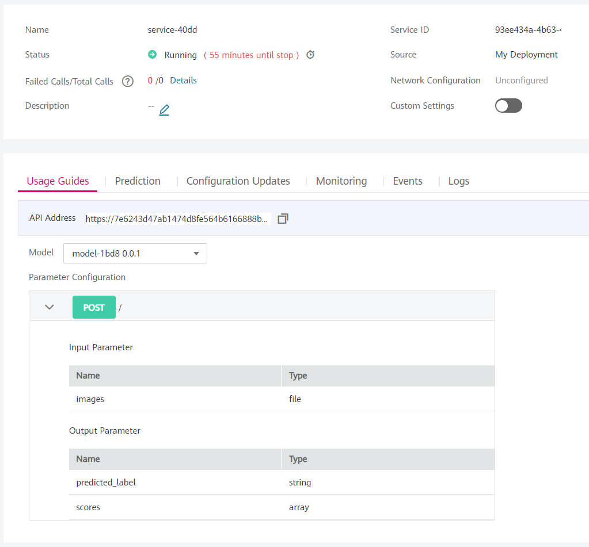

# Custom container deployment in ModelArts
## Inference part


### Introduction
In this documentation you will see the following methods step by step

[Inference](#inference)
  - [Creating the flask webserver](#creating-the-flask-webserver)
  - [Dockerize the flask app](#dockerize-the-flask-app)
  - [Deploying the model](#deploying-the-model)

Oter documentations regarding the custom container
- For the model building, [click here](guimd.md)
- For the training part, [click here](cli_training.md)

## Inference 

### Creating the flask webserver
Let's start by defining the `__name__` variable which is a special built-in variable in Python which evaluates to the name of the current module.
```python
if __name__ == '__main__':
    app.run(host='0.0.0.0', debug=False, threaded=False, port=8080)
```
We can transfer files from OBS to modelarts, our name of the bucket in obs is called customcontainer, and we define the input and output directories in the argument list
```python
from otc_obs_util import *

def get_model_from_obs():
    download_files_from_s3(Bucket="customcontainer",input_dir="mnist_data_out", output_dir=".")
```

You have to define these variables below the imports: 
```python
app = Flask(__name__)
model = None
graph = None
sess = None
```

We build the model in the init function with the following lines:
```python
def init():
    global graph
    global sess

    graph = tf.get_default_graph() #
    sess = tf.Session() #
    set_session(sess) #
    # codes to build the model
    return model
```
We need to define a predict function with the root endpoint and the dictionary output must look like the dict_output variable:
```python
@app.route('/', methods=['GET','POST'])
def predict():
    # codes...
    global model
    if not model:
        model = init()

    with graph.as_default():
        out = model.predict(x)
    # codes...
    dict_output = {"predicted_label":"4", "scores":["8", "0.5"], ["0", "0.3"], ["3", "0.2"]]}
    return jsonify(dict_output)
```


## Inference in ModelArts
### Deploying the service
Check your model and the specifications and if you are done, click on Create Now


After creating the real time serviceyou will see under the real time services. You have to wait a few minutes until it finishes the deployment.





