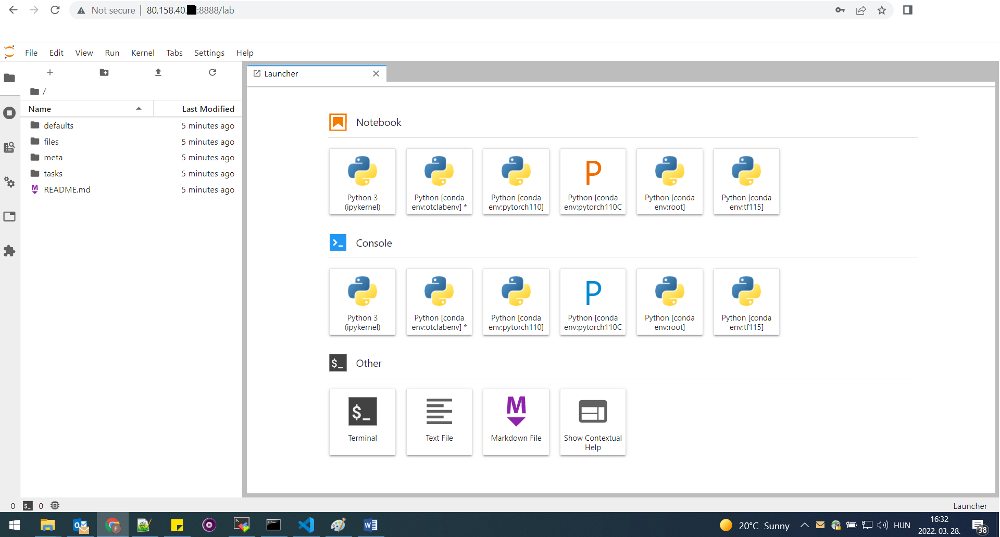

# Jupyter Lab installation and run


### Introduction
JupyterLab is the latest web-based interactive development environment for notebooks, code, and data.  Full documentation and frequently asked questions are available on the BigDataAI squad workplace.


### Preparation to run jupyter lab
Navigate into the folder where you have the environment installer script
```
 cd conda_otclabenv_py38/files/
```
Run the shell script to install this conda environment
```
bash create-otc-conda-env.sh
```
Once the environment has been installed properly check if the new environment: otclabenv is present
```
conda env list
```
Activate the newly installed environment
```
conda activate otclabenv
```
(otclabenv) should appear in front of your hostname like this:
```
(otclabenv) ubuntu@elef:~/ai-image/ansible/roles/conda_otclabenv_py38/files$
```
Run jupyter notebooks by entering "jupyter lab", the ip adress and the port number :
```
jupyter lab --ip=0.0.0.0 --port=8888
```
Exit there with :, then q and hit y

You're already running the jupyter lab locally and can reach via this url:
```
http://localhost:8888/?token=<token_id>
```

To reach your jupyter lab globally set the security role for your vm in the OTC console:


After setting the security group roles you can reach your jupyter lab not only locally, but now globally too:
```
http://80.158.40.17:8888/lab
```
Now you can see jupyter lab in your web browser:

