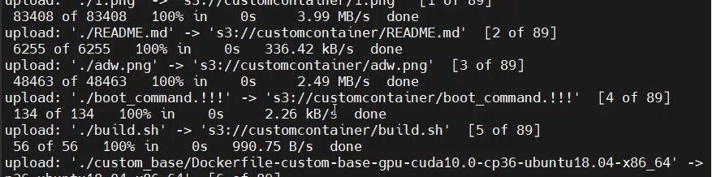
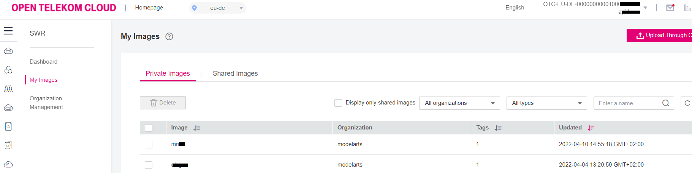
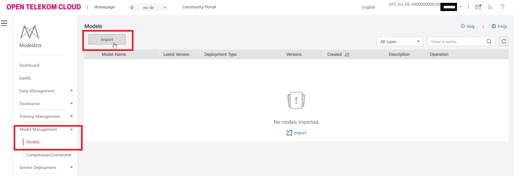
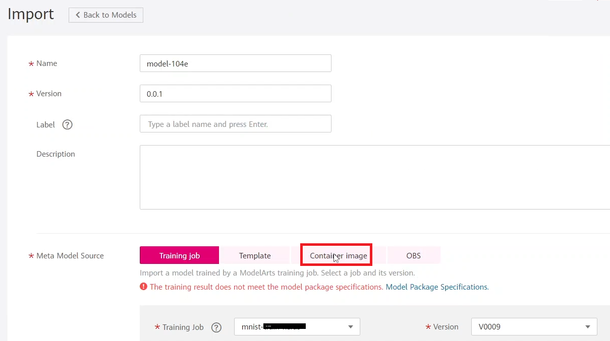
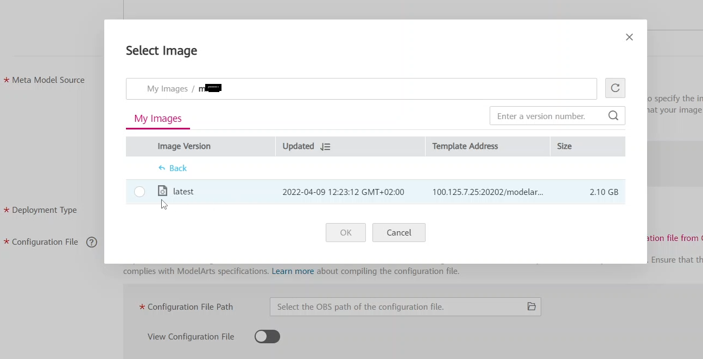
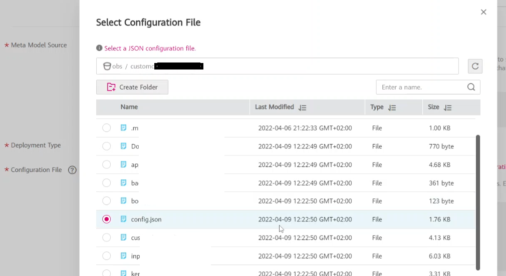
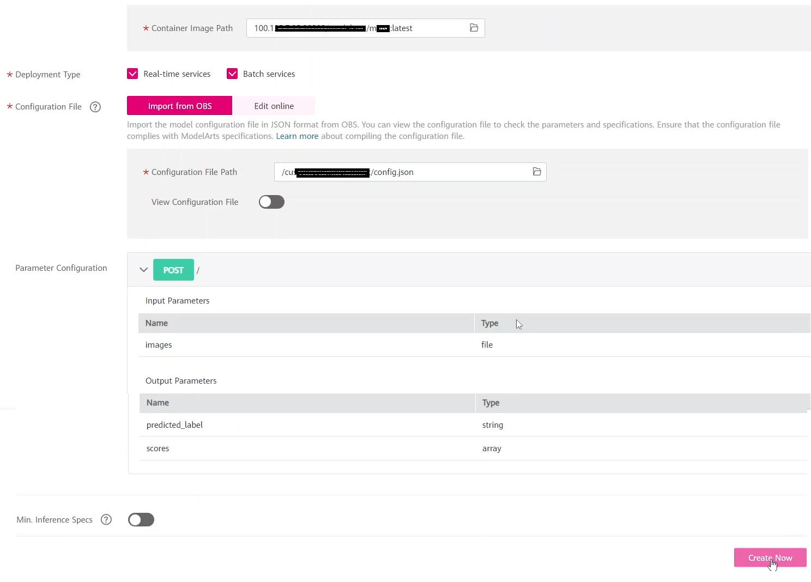
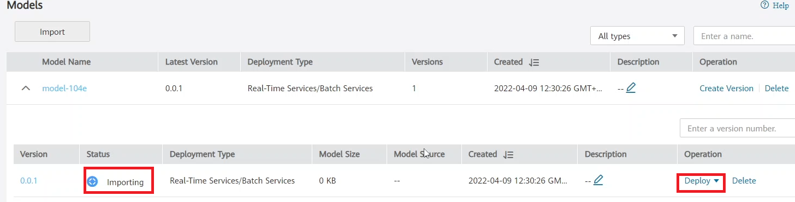

# Custom container deployment in ModelArts
## Model building part

1. [Building the training job](#building-the-training-job)
2. [Creating the model](#creating-the-model)
3.  [Deploying the model](#deploying-the-model)

For the operations in the CLI, [click here](cli.md)
</br>


## Dockerize the flask app
Activate the newly installed environment. 100.X.Y.Z is the SWR repository's address
```bash
s3cmd sync . s3://customcontainer/

docker build . -t <image_name>

sudo docker tag <image_name>:latest 100.X.Y.Z:20202/modelarts/mnist:latest

sudo docker push 100.X.Y.Z:20202/<image_name>:latest
```

You should see a similar output:



Then you should see your docker image in SWR:



<br/>

## Creating the Model

Now you should import the trainjob you've created before and make a model from it that can be later deployed into a service.
So click on Model --> Model Management --> Import


Select the Custom Container tab

Browse your image that you created in the command line


You also need a configuration file for your model 

The configuration needs to contain the following parameters:

``` json
{
    "model_type": "Image",
    "metrics": {
        "f1": 0,
        "accuracy": 0,
        "precision": 0,
        "recall": 0
    },

    "model_algorithm": "image_classification",
    "apis": [
        {
            "procotol": "http",
            "url": "/",
            "request": {
                "Content-type": "multipart/form-data",
                "data": {
                    "type": "object",
                    "properties": {
                        "images": {
                            "type": "file"
                        }
                    }
                }
            },
            "method": "post",
            "response": {
                "Content-type": "multipart/form-data",
                "data": {
                    "required": [
                        "predicted_label",
                        "scores"
                    ],
                    "type": "object",
                    "properties": {
                        "predicted_label": {
                            "type": "string"
                        },
                        "scores": {
                            "items": {
                                "minItems": 2,
                                "items": [
                                    {
                                        "type": "string"
                                    },
                                    {
                                        "type": "number"
                                    }
                                ],
                                "type": "array",
                                "maxItems": 2
                            },
                            "type": "array"
                        }
                    }
                }
            }
        }
    ]
}
```

Once you're satisfied with the parameter configuration click on create now


If you clicked create now you will see that your model is being imported the following screenshot shows that



After importing and building of your model are finished click on Deploy --> Real time service

