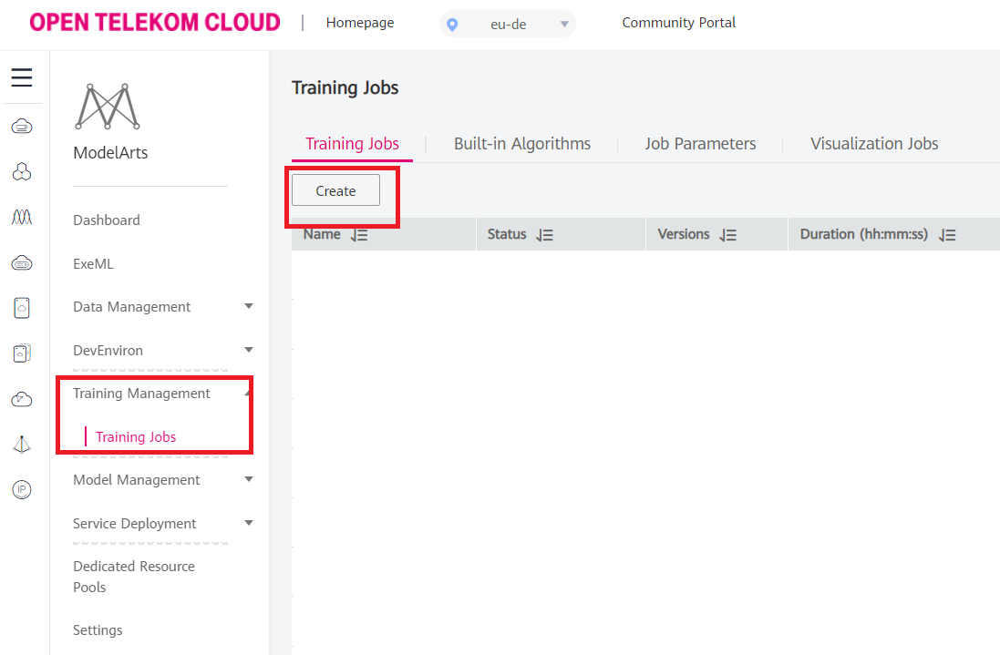
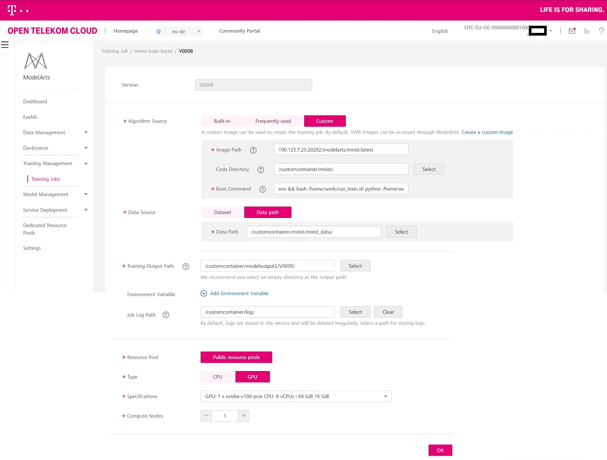
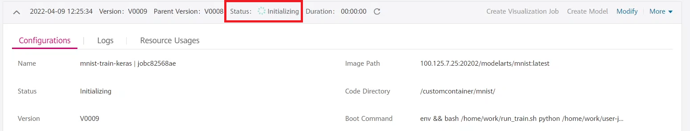
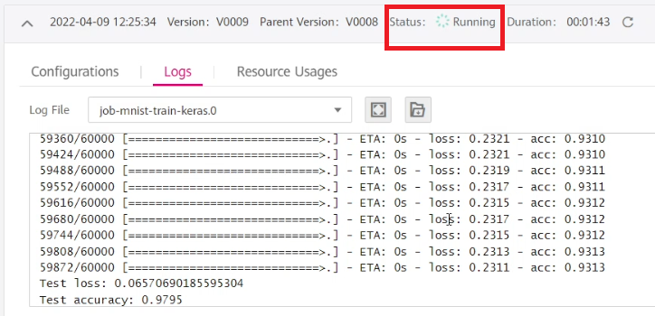

# Custom container deployment in ModelArts
## Training part


### Introduction
In this documentation you will see the following methods step by step
[Training](#training)
- [Creating the training](#creating-the-training)
- [Building the training job](#building-the-training-job)


Other documentations regarding the custom container
- For model building, [click here](guimd.md)
- For inference, [click here](cli_inference.md)

<br/>


## Training
### Creating the training
First thing to do in machine learning is getting your dataset. In this case we are importing it from OBS in a gzip format
```python
def main():

    cwd = os.getcwd()

    with gzip.open(FLAGS.data_dir +'/mnist.pkl.gz', 'rb') as f:
        (x_train, y_train), (x_test, y_test) = pickle.load(f, encoding='latin-1')
```
Then we format the train and test variables to be in a format that our model can be fed with later
```python
    if K.image_data_format() == 'channels_first':
        x_train = x_train.reshape(x_train.shape[0], 1, img_rows, img_cols)
        x_test = x_test.reshape(x_test.shape[0], 1, img_rows, img_cols)
        input_shape = (1, img_rows, img_cols)
    else:
        x_train = x_train.reshape(x_train.shape[0], img_rows, img_cols, 1)
        x_test = x_test.reshape(x_test.shape[0], img_rows, img_cols, 1)
        input_shape = (img_rows, img_cols, 1)

    x_train = x_train.astype('float32')
    x_test = x_test.astype('float32')
    x_train /= 255
    x_test /= 255
```
We build our Keras model

```python
    model = Sequential()
    model.add(Conv2D(32, kernel_size=(3, 3),
                     activation='relu',
                     input_shape=input_shape))
    model.add(Conv2D(64, (3, 3), activation='relu'))
    model.add(MaxPooling2D(pool_size=(2, 2)))
    model.add(Dropout(0.25))
    model.add(Flatten())
    model.add(Dense(128, activation='relu'))
    model.add(Dropout(0.5))
    model.add(Dense(num_classes, activation='softmax'))

    model.compile(loss=keras.losses.categorical_crossentropy,
                  optimizer=keras.optimizers.Adadelta(),
                  metrics=['accuracy'])

    model.fit(x_train, y_train,
              batch_size=batch_size,
              epochs=epochs,
              verbose=1,
              validation_data=(x_test, y_test))

```
This is how you can upload your trained model

```python
upload_files_to_s3(Bucket="customtarget",
                               input_dir="mnist_data_out", # this is directory
                               output_dir="mnist_data_out/"
                               )
```

The argument handling should look like the following
```python
if __name__ == '__main__':
  parser = argparse.ArgumentParser()
  parser.add_argument('--data_dir', '--data_url', type=str, default='mnist_data',
                      help='Directory for storing input data')
  parser.add_argument('--train_dir', '--train_url', type=str, default='./',
                      help='Directory for storing trained data output ')
  FLAGS, unparsed = parser.parse_known_args()
  main()
```
## Training in ModelArts

### Building the training job

Navigate into Modelarts --> Training Management --> Training Jobs:



You should fill out your trainjob to be created likes this:
<br/>

The following boot command is to be used:
```bash
env && bash /home/work/run_train.sh python /home/work/user-job-dir/mnist/kerastrain.py --data_url /home/work/user-job-dir/mnist/mnist_data --train_dir /home/work/user-job-dir/mnist/mnist_data_out
```

Code Directory has to be filled. You have to upload your code to an OBS bucket for example: __/customtarget/mnist__ that will be used for training

Image path must be filled as well. Here you have to browse the image from SWR.




As in the picture below your training job is now being created, it's initializing, you should wait till it finishes



You can see that your training job is already running, the training has been finished:

</br>